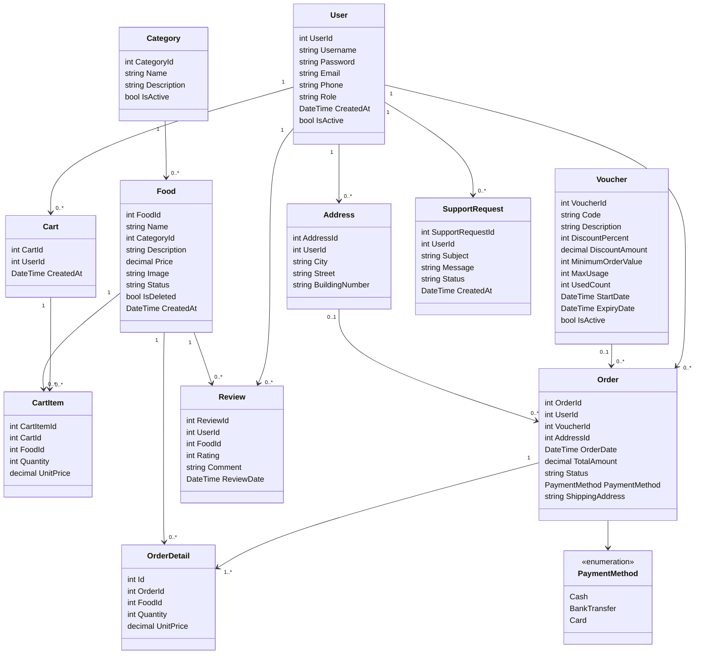
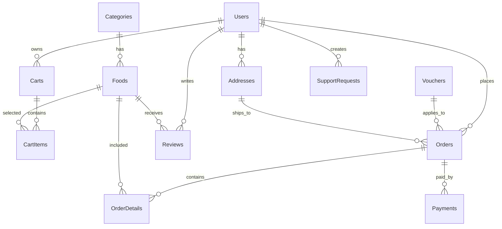

# FoodOrderWeb Architecture

## Technology

- UI: ASP.NET Core MVC (.NET 8)
- Language: C#
- Database: SQL Server
- DB Tool: SQL Server Management Studio
- DB Access: ADO.NET with Microsoft.Data.SqlClient
- Architecture: Three-tier/layer architecture

## Three-layer Structure

```text
Presentation Layer
  Controllers + Views
  AccountController, MenuController, CartController, OrdersController, AdminController

Business Logic Layer
  BLL services
  UserService, FoodService, CartService, OrderService, VoucherService

Data Access Layer
  DAL repositories
  UserRepository, FoodRepository, OrderRepository, VoucherRepository

Database Layer
  SQL Server tables
  Users, Foods, Categories, Orders, OrderDetails, Vouchers...
```

Request flow:

```text
Browser
  -> MVC Controller
  -> BLL Service
  -> DAL Repository
  -> SQL Server Table
```

## Class Diagram



## Database Mapping



## Use Case Coverage

- Customer: Register, Login, Search Food, Manage Cart, Add Voucher, Payment, Place Order, View Order History, Track Order by status, Review, Support Customer.
- Admin: Manage Foods, Manage Categories, Manage Users, View Report, Update Order Status.
- Staff-compatible flow: Update Order Status, View Order History, Support Requests.
